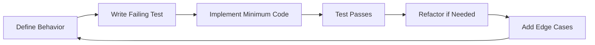

# Test Philosophy & Development Strategy

**Document Version**: 1.0  
**Date**: August 25, 2025  
**Purpose**: Define testing approach that balances quality assurance with development velocity

---

## 🎯 **Core Testing Principle**

> **"Test behavior, not implementation. Tests should describe what the system does for users, not how it does it internally."**

We follow **Behavior-Driven Development (BDD)** principles with pragmatic Test-Driven Development (TDD) where it adds value. Tests are acceptance criteria that prove the system works for real healthcare scenarios, not arbitrary code coverage metrics.

---

## 🔄 **Development-Test Feedback Loop**

### **The Pragmatic TDD Cycle**



### **When to Write Tests First (TDD)**
✅ **Always Test-First**:
- **Domain logic**: Patient demographics, medication calculations
- **Healthcare validation**: HL7 segment requirements, FHIR resource constraints
- **Configuration inference**: Pattern recognition accuracy
- **Critical algorithms**: Message parsing, field encoding

✅ **Example - Domain Logic TDD**:
```csharp
[Fact]
public void Prescription_Should_Calculate_Days_Supply_Correctly()
{
    // Arrange - Define expected behavior
    var prescription = new Prescription
    {
        Quantity = 30,
        DosesPerDay = 2,
        UnitsPerDose = 1
    };
    
    // Act - Execute behavior
    var daysSupply = prescription.CalculateDaysSupply();
    
    // Assert - Verify behavior matches healthcare requirements
    daysSupply.Should().Be(15); // 30 units ÷ 2 per day = 15 days
}
```

### **When to Write Tests After (Pragmatic)**
⚡ **Test-After Acceptable**:
- **UI/CLI interactions**: Test manually first, automate valuable scenarios
- **External integrations**: Mock boundaries, don't test external systems
- **Exploratory features**: Spike first, test once approach is validated
- **Performance optimizations**: Baseline first, then test improvements

---

## 📊 **Test Pyramid Strategy**

### **Our Healthcare-Adapted Test Pyramid**

```
         /\
        /E2E\        5% - Critical healthcare workflows
       /------\
      /Integration\  25% - Cross-standard validation  
     /-----------\
    /   Unit      \ 70% - Domain logic & parsing
   /--------------\
```

### **Unit Tests (70% of tests)**
**Focus**: Core healthcare domain logic, isolated and fast

```csharp
[Theory]
[InlineData("19800101", 45)]  // Born Jan 1, 1980, age 45 in 2025
[InlineData("20100615", 15)]  // Born Jun 15, 2010, age 15 in 2025
public void Patient_Should_Calculate_Age_From_HL7_Birthdate(string hl7Date, int expectedAge)
{
    var patient = new Patient { BirthDate = HL7DateParser.Parse(hl7Date) };
    patient.GetAge(new DateTime(2025, 08, 25)).Should().Be(expectedAge);
}
```

### **Integration Tests (25% of tests)**
**Focus**: Standards interoperability, configuration validation

```csharp
[Fact]
public void Should_Generate_Compatible_Messages_Across_Standards()
{
    // Arrange - Same prescription data
    var prescription = TestData.CreateTestPrescription();
    
    // Act - Generate in all three standards
    var hl7Message = _hl7Generator.Generate(prescription);
    var fhirResource = _fhirGenerator.Generate(prescription);
    var ncpdpMessage = _ncpdpGenerator.Generate(prescription);
    
    // Assert - All contain same core information
    hl7Message.Should().Contain("LISINOPRIL");
    fhirResource.MedicationCodeableConcept.Text.Should().Be("LISINOPRIL");
    ncpdpMessage.DrugDescription.Should().Be("LISINOPRIL");
}
```

### **End-to-End Tests (5% of tests)**
**Focus**: Critical paths through entire system

```csharp
[Fact]
public void Should_Infer_Epic_Configuration_From_Sample_Messages()
{
    // Arrange - Real Epic HL7 samples (anonymized)
    var epicSamples = TestData.LoadEpicSamples();
    
    // Act - Complete inference workflow
    var config = _configService.InferFromSamples(epicSamples);
    var validation = _validator.ValidateWithConfig(config, TestData.NewEpicMessage);
    
    // Assert - Configuration works for new messages
    validation.ConformanceScore.Should().BeGreaterThan(0.90);
    validation.VendorIdentified.Should().Be("Epic");
}
```

---

## 🎯 **Acceptance Criteria as Tests**

### **Healthcare Scenario-Driven Testing**

Each feature starts with acceptance criteria written as tests:

```csharp
public class PrescriptionWorkflowTests
{
    [Fact(DisplayName = "As a pharmacy system, I need to receive prescription orders via HL7 RDE messages")]
    public void Should_Generate_Valid_RDE_Message_For_Prescription()
    {
        // Given a prescription from a provider
        var prescription = new PrescriptionBuilder()
            .ForPatient("John", "Doe", "19700101")
            .WithMedication("Lisinopril", "10mg", "QD")
            .PrescribedBy("Dr. Smith", "1234567890")
            .Build();
            
        // When generating an HL7 message
        var rdeMessage = HL7Generator.GenerateRDE(prescription);
        
        // Then it should contain all required segments for pharmacy processing
        rdeMessage.Should().HaveSegment("MSH");
        rdeMessage.Should().HaveSegment("PID").WithPatientName("DOE^JOHN");
        rdeMessage.Should().HaveSegment("RXE").WithMedication("LISINOPRIL 10MG");
        rdeMessage.Should().PassHL7Validation(ValidationMode.Compatibility);
    }
}
```

---

## 🚫 **What NOT to Test**

### **Avoid Testing**:
- **Framework behavior**: Don't test .NET, EF Core, or other frameworks
- **External services**: Mock boundaries, don't test external APIs
- **Generated code**: Don't test auto-generated DTOs or proxies
- **Configuration**: Don't test JSON deserialization unless custom logic exists
- **Trivial code**: Simple getters/setters without logic

### **Example - Don't Test Framework**:
```csharp
// ❌ BAD: Testing framework functionality
[Fact]
public void Should_Serialize_Object_To_Json()
{
    var obj = new Patient { Name = "Test" };
    var json = JsonSerializer.Serialize(obj);
    json.Should().Contain("Test"); // Testing System.Text.Json, not our code
}

// ✅ GOOD: Testing our serialization logic
[Fact]
public void Should_Serialize_Patient_With_HL7_Compliant_Format()
{
    var patient = new Patient { LastName = "Doe", FirstName = "John" };
    var hl7Name = patient.ToHL7Format(); // Our custom logic
    hl7Name.Should().Be("DOE^JOHN"); // Testing our HL7 formatting rules
}
```

---

## 📈 **Coverage Philosophy**

### **Coverage Targets by Component Type**

| Component | Target | Rationale |
|-----------|--------|-----------|
| **Domain Models** | 95%+ | Core business logic must be bulletproof |
| **Healthcare Validation** | 90%+ | Patient safety depends on correct validation |
| **Configuration Inference** | 85%+ | Key differentiator must be reliable |
| **Message Generation** | 90%+ | Must produce valid healthcare messages |
| **CLI Commands** | 60%+ | User interaction, manual testing acceptable |
| **GUI Code** | 40%+ | Visual testing more valuable than unit tests |
| **Infrastructure** | 70%+ | Focus on boundaries, not implementation |

### **Quality Over Quantity**
```bash
# ❌ Bad Metric
"We have 95% code coverage" # Meaningless without context

# ✅ Good Metric
"100% of HL7 required fields are tested for presence"
"95% of Epic-specific patterns are validated"
"All critical patient safety validations have tests"
```

---

## 🔄 **Test Maintenance Strategy**

### **Test Lifecycle**

1. **Test Creation**: Written with feature or just before
2. **Test Evolution**: Refactored as understanding improves
3. **Test Retirement**: Deleted when feature removed or obsolete
4. **Test Quarantine**: Flaky tests isolated, fixed or removed

### **Preventing Test Rot**
```csharp
// ❌ Fragile Test - Implementation-coupled
[Fact]
public void Should_Have_Exactly_23_Fields() // Breaks when fields added
{
    var segment = new PIDSegment();
    segment.Fields.Count.Should().Be(23);
}

// ✅ Robust Test - Behavior-focused
[Fact]
public void Should_Have_Required_Patient_Demographics()
{
    var segment = new PIDSegment();
    segment.Should().HavePatientId();
    segment.Should().HavePatientName();
    segment.Should().HaveBirthDate();
    // Tests requirements, not implementation details
}
```

---

## 🎭 **Test Naming Conventions**

### **Behavior-Driven Names**
```csharp
// Pattern: Should_ExpectedBehavior_When_StateUnderTest

[Fact]
public void Should_Generate_Valid_HL7_Message_When_All_Required_Fields_Present() { }

[Fact]
public void Should_Return_Validation_Error_When_Patient_ID_Missing() { }

[Fact]
public void Should_Infer_Epic_Configuration_When_Given_Epic_Sample_Messages() { }

// For healthcare scenarios, include context
[Fact(DisplayName = "Pharmacy systems should accept RDE messages with missing insurance when patient pays cash")]
public void Should_Allow_Missing_IN1_Segment_When_Self_Pay_Patient() { }
```

---

## 🏥 **Healthcare-Specific Testing Requirements**

### **Real-World Message Testing**
```csharp
public class RealWorldCompatibilityTests
{
    [Theory]
    [MemberData(nameof(GetAnonymizedHospitalMessages))]
    public void Should_Parse_Real_Hospital_Messages(string messageFile, string vendor)
    {
        // Test against actual (anonymized) production messages
        var message = File.ReadAllText($"TestData/RealWorld/{vendor}/{messageFile}");
        
        var result = _parser.Parse(message, ValidationMode.Compatibility);
        
        result.Should().BeSuccess();
        result.Value.Should().NotBeNull();
        _logger.LogInformation($"Successfully parsed {vendor} message: {messageFile}");
    }
}
```

### **Vendor-Specific Pattern Tests**
```csharp
[Theory]
[InlineData("Epic", "PAT1234567", @"^\d{7}$")] // Epic uses 7-digit MRNs
[InlineData("Cerner", "10000000001", @"^\d{11}$")] // Cerner uses 11-digit IDs
[InlineData("Allscripts", "AS-123456", @"^AS-\d{6}$")] // Allscripts prefix
public void Should_Recognize_Vendor_ID_Patterns(string vendor, string id, string pattern)
{
    var config = _configService.GetVendorConfig(vendor);
    config.PatientIdPattern.Should().Be(pattern);
    Regex.IsMatch(id, pattern).Should().BeTrue();
}
```

---

## 🚀 **Test Execution Strategy**

### **Test Tiers**

```yaml
# Fast Tests (< 100ms each) - Run on every save
fast-tests:
  - Unit tests
  - Domain logic tests
  - Parsing tests
  
# Standard Tests (< 1 second each) - Run on every commit  
standard-tests:
  - Integration tests
  - Validation tests
  - Configuration tests
  
# Slow Tests (> 1 second each) - Run on CI/CD
slow-tests:
  - End-to-end workflows
  - Performance benchmarks
  - Real-world message corpus
```

### **Continuous Testing**
```bash
# Developer workflow
dotnet watch test --filter "Category!=Slow"  # Continuous fast feedback

# Pre-commit hook
dotnet test --filter "Category!=E2E"  # All except E2E

# CI/CD pipeline
dotnet test  # Full test suite including performance
```

---

## 💡 **Decision Framework: When to Add Tests**

### **Add Test When**:
1. **Bug is found**: Regression test prevents reoccurrence
2. **Behavior is unclear**: Test documents expected behavior
3. **Healthcare requirement**: Patient safety or compliance need
4. **Complex logic**: Algorithm or calculation needs verification
5. **Integration point**: Contract between systems needs validation

### **Skip Test When**:
1. **Prototype code**: Still exploring approach
2. **Trivial logic**: No healthcare or business logic
3. **UI layout**: Visual inspection more effective
4. **External dependency**: Can't control external service

---

## 📚 **Test Documentation**

### **Tests as Living Documentation**
```csharp
public class HL7ValidationDocumentationTests
{
    [Fact(DisplayName = "HL7 v2.3 Specification: PID-3 (Patient ID) is required")]
    public void PID_3_Patient_Identifier_Is_Required_Per_HL7_Spec()
    {
        var message = new HL7MessageBuilder()
            .WithSegment("PID")
            .WithoutField("PID.3")  // Omit patient ID
            .Build();
            
        var result = _validator.Validate(message, ValidationMode.Strict);
        
        result.Errors.Should().Contain(e => 
            e.Field == "PID.3" && 
            e.Severity == ErrorSeverity.Required);
    }
    
    [Fact(DisplayName = "Real-World: Epic sends patient ID in PID-3.1 subfield")]
    public void Epic_Sends_Patient_ID_In_PID_3_1_Subfield()
    {
        var epicMessage = TestData.GetEpicSampleMessage();
        var pid3 = _parser.GetField(epicMessage, "PID.3.1");
        
        pid3.Should().MatchRegex(@"^\d{7}$"); // Epic 7-digit MRN
    }
}
```

---

## 🎯 **Success Metrics for Testing**

### **What Good Testing Looks Like**

✅ **Good Testing Metrics**:
- Zero critical healthcare workflow failures in production
- New developers can understand system behavior from tests
- Tests catch 90%+ of bugs before production
- Test suite runs in <5 minutes locally
- Real hospital messages parse successfully 95%+ of time

❌ **Poor Testing Metrics**:
- X% code coverage (meaningless without context)
- Number of tests (quantity != quality)
- Lines of test code (verbose != valuable)

---

## 🔄 **Test Review Process**

### **Test PR Checklist**
- [ ] Tests describe behavior, not implementation
- [ ] Test names clearly indicate what they verify
- [ ] Healthcare scenarios include real-world examples
- [ ] No testing of framework functionality
- [ ] Performance impact acceptable (test runtime)
- [ ] Flaky tests fixed or marked for quarantine

### **Test Review Questions**
1. **Would this test catch a real bug that affects users?**
2. **Can a new developer understand the feature from this test?**
3. **Will this test break for valid code changes?**
4. **Is the test runtime acceptable for its tier?**

---

**Remember**: Tests are not about achieving coverage metrics. They're about proving our system works correctly for real healthcare scenarios. Every test should either prevent a bug that would affect patient care or document critical system behavior.

**The Goal**: When a test fails, it should immediately be clear what healthcare scenario is broken and why it matters.