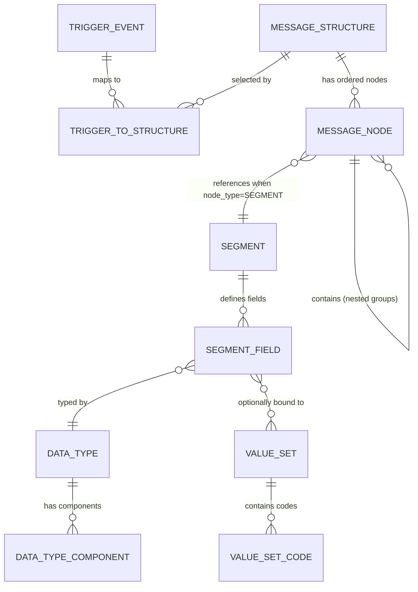

# DATA\_README.md

**HL7 v2 Artifacts: Definitions, Relationships, and How We Model Them**

> **Purpose.** Make it obvious to both devs and AI agents what the five HL7 v2 “primitives” are—**Data Types, Segments, Tables (value sets), Trigger Events, and Messages**—and how our JSON files represent, validate, and link them together.

---

## TL;DR — The Five Artifacts at a Glance

| Artifact                | What it defines                                                                                                           | Where it shows up                                                               | Our JSON template                        | Example in repo                  | Primary source / validation                                       |
| ----------------------- | ------------------------------------------------------------------------------------------------------------------------- | ------------------------------------------------------------------------------- | ---------------------------------------- | -------------------------------- | ----------------------------------------------------------------- |
| **Data Type**           | The **grammar** of a field (primitive vs composite, components, allowed encoding)                                         | Inside **segment fields** (e.g., `AL1.2` is `ID`)                               | `_TEMPLATES/datatype_template.json`      | `datatypes/id.json` (ID)         | hl7‑dictionary + our validator (datatype)                         |
| **Segment**             | A 3‑letter **container of fields** (with position, usage, cardinality, data type, table binding)                          | The building blocks of **message structures**                                   | `_TEMPLATES/segment_template.json`       | `segments/al1.json` (Allergies)  | hl7‑dictionary + our validator (segment)                          |
| **Table** (Value Set)   | The **legal codes** for coded fields (HL7‑defined, user‑defined, or external)                                             | Referenced by **fields** whose type is coded (ID/IS/CNE/CWE/CE…)                | `_TEMPLATES/table_template.json`         | `tables/0005.json` (Race)        | hl7‑dictionary + our validator (table)                            |
| **Trigger Event**       | The **business action** (e.g., “A01 Admit/Visit”) that decides *when/why* a message is sent and what response is expected | Appears logically (workflow) and in the wire as `MSH-9` component 2 and `EVN-1` | `_TEMPLATES/triggerevent_template.json`  | `triggerevents/a01.json`         | **Manual research** (not in hl7‑dictionary). See sprint process.  |
| **Message** (Structure) | The **ordered tree** of segments and groups for a specific type/event                                                     | `MSH-9` component 1–2 identify it (e.g., `ADT^A01` → structure **ADT\_A01**)    | `_TEMPLATES/message_template.json`       | `messages/adt_a01.json`          | hl7‑dictionary + our validator (message)                          |

---

## How They Relate (mental model)

Real‑world event → **Trigger Event** → selects a **Message** (structure) → composed of **Segments** → each has **Fields** with **Data Types** → some fields bind to **Tables** for allowed codes.

```mermaid
flowchart LR
  E[Business event] --> TE[Trigger Event <A01>]
  TE --> MS[Message Structure <ADT_A01>]
  MS -->|ordered| SG[Segments & Segment Groups]
  SG --> F[Fields]
  F --> DT[Data Types]
  F --> VS[Tables (Value Sets)]
```

---

## Precise Definitions (with repo examples)

### 1) Data Types (field grammar)

* **What**: The schema for a single field—primitive (e.g., `ST`, `ID`) or composite (e.g., `CE`, `XPN`) with components and repeats.
* **Why it matters**: Controls parsing, encoding (`^`, `&`, etc.), and which value sets can bind to the field.
* **In our JSON**: `dataType`, `category`, optional `components{}`, `constraints`, `examples`, and a `usage[]` list indicating common field paths. See the template for required keys.
* **Example**: `ID` is a primitive “coded value for **HL7‑defined** tables,” used in `EVN.1` (event code), `PID.8` (administrative sex), etc.

> **Note:** `ID` vs `IS`. In our modeling, `ID` values **must** come from HL7 tables; `IS` comes from **user‑defined** tables. That distinction drives validation choices in segments that use these types.

---

### 2) Segments (collections of fields)

* **What**: A three‑letter building block (e.g., `MSH`, `PID`, `AL1`) with ordered, typed fields (`AL1.1 … AL1.6`), usage (`R/O/C/X`), cardinality, and optional table binding per field.
* **In our JSON**: `fields{}` maps `SEG.N` to metadata (name, description, `dataType`, `cardinality`, optional `table`, `validValues`, `components`, etc.).
* **Example**: `AL1` (Allergy) — `AL1.2` = `ID` bound to table `0127` (Allergy Type); `AL1.4` = `IS` bound to `0128` (Severity).

---

### 3) Tables (value sets)

* **What**: Enumerations of legal codes. Provenance can be **hl7** (official), **user\_defined**, or **external** (e.g., ISO/CDC).
* **In our JSON**: `type`, `values[{code,description,definition}]`, and `usedIn[]` for reverse lookups.
* **Example**: Table **0005** (Race) holds CDC codes used by `PID.10`.

---

### 4) Trigger Events (business cause)

* **What**: The workflow/business action (e.g., **A01 Admit/Visit**) that specifies *when* to send a message and the expected response (ACK). It ties to a message structure and enumerates required/optional segments at a business level.
* **Important nuance**: **Not provided by hl7‑dictionary**; we research from official HL7 docs / reputable dictionaries and encode manually. This gap is acknowledged and enforced in our sprint process.
* **In our JSON**: `triggerEvent`, `messageStructure` (e.g., `"ADT^A01"`), `businessPurpose`, `timing`, `responseMessage`, and segment lists (`required[]`, `optional[]`).
* **Example**: `A01` with `messageStructure: "ADT^A01"` and required `MSH, EVN, PID, PV1`.

---

### 5) Messages (message structures)

* **What**: The **wire‑level schema**—an ordered tree of segments and segment **groups** (with usage + cardinality) used to build a full message instance.
* **In our JSON**: We record `messageType` + `triggerEvent` (e.g., `ADT` + `A01`) and a `structure[]` containing `segment` or `group` nodes with `usage` and `cardinality`.
* **Example**: `ADT_A01` includes `MSH`, `EVN`, `PID`, `PV1`, with optional groups like **PROCEDURE** (PR1, ROL) and **INSURANCE** (IN1, IN2, IN3).

---

## Canonical Relationships (ERD)

> Use this to guide joins and lookups in tools/agents.



**How to read this with our files:**

* `A01` (**Trigger Event**) → maps to **Message Structure** `ADT_A01`; the structure lists ordered segments/groups. 
* Each **Segment**’s **Field** references a **Data Type** and may bind a **Value Set** (Table). Example: `AL1.2` → `ID` + table `0127`. 

---

## Cross‑walk Example (end‑to‑end)

**Given** a message with `MSH-9 = ADT^A01`:

1. Use `triggerEvents/a01.json` to confirm **business purpose**, **timing**, expected **ACK**, and business‑level required segments (`MSH, EVN, PID, PV1`).
2. Load `messages/adt_a01.json` to get the precise **wire structure** (segment order, usage, groups, and cardinalities).
3. When you encounter `AL1`, consult `segments/al1.json` for field typing, repeats, and table bindings (`AL1.2` → Table `0127`, `AL1.4` → `0128`).
4. If a field is coded, look up codes in the corresponding **Table** (e.g., `PID.10` uses Table `0005` Race).
5. If a field’s **Data Type** is composite (e.g., `CE`), its component grammar comes from the **Data Type** definition/template. For a primitive coded type like `ID`, obey the “HL7‑defined table only” constraint. 

---

## Our JSON Templates (contract for contributors & agents)

* **Data Types** — required keys, component map, examples, constraints.
* **Segments** — `fields{}` keyed by `SEG.N`, each with `dataType`, `usage`, `cardinality`, optional `table` + `validValues`, and (if composite) `components`.
* **Tables** — `values[]` with `code`, `description`, optional `definition`, and `usedIn[]` for reverse lookups.
* **Trigger Events** — business metadata plus `messageStructure` and segment lists. (Manual research; see “Process” below.)
* **Messages** — `structure[]` of `segment`/`group` nodes with `usage` and `cardinality`; “notes” per node for contextual rules (e.g., `MSH.9 = "ADT^A01"`).

> **Naming conventions used by tools:**
>
> * Files are lowercase: `datatypes/id.json`, `segments/al1.json`, `messages/adt_a01.json`. The table files are **padded**: `tables/0005.json`. This matches the paths hard‑coded in `validate-against-hl7-dictionary.js`.

---

## Research & Validation Workflow

We follow a strict **template‑first** process with automated checks where possible. Full details in **DATA\_SPRINT.md**.

1. **Start from our template** for the target artifact. (See “Our JSON Templates.”)
2. **Research using hl7‑dictionary** (covers datatypes, segments, tables, messages).
3. **Fill the template** with concise, business‑focused descriptions and minimal examples.
4. **Validate with our script**:

   ```bash
   # Supported by hl7-dictionary:
   node scripts/validate-against-hl7-dictionary.js datatype CX
   node scripts/validate-against-hl7-dictionary.js segment MSH
   node scripts/validate-against-hl7-dictionary.js table 0005
   node scripts/validate-against-hl7-dictionary.js message ADT_A01
   ```

   The script compares our files to the library and flags mismatches (datatypes/segments/tables/messages). Trigger events intentionally print **“not supported”** (manual only).
5. **For Trigger Events** (not in hl7‑dictionary):

   * Use official HL7 v2.3 documentation and reputable dictionaries for verification.
   * Populate `triggerevents/<code>.json` with `businessPurpose`, `timing`, `responseMessage`, and the segment lists.
   * Cross‑check against the corresponding **message** in `messages/` to ensure consistency (`messageType^triggerEvent` pair).

> **Implementation note:** Online reference dictionaries are useful for human validation but often load data dynamically, so we do **manual entry with citations** for trigger events and any edge cases we cannot validate automatically. This is explicitly called out in our sprint plan.

---

## Typical Lookups Our Tools Perform

1. **“What are the valid segments for ADT^A01?”**

   * Read `messages/adt_a01.json` → walk `structure[]` for ordered segments/groups.

2. **“What does AL1.2 allow?”**

   * Read `segments/al1.json` → `fields["AL1.2"]` → `dataType: "ID"`, `table: "0127"`.
   * Optionally load `tables/0127.json` for codes (if populated).

3. **“Which table codes populate PID.10?”**

   * Read `tables/0005.json` → list of CDC race codes. (Reverse lookup via `usedIn: ["PID.10"]`.)

4. **“How should EVN.1 be validated in ADT^A01?”**

   * From `messages/adt_a01.json` notes and `triggerevents/a01.json`, require `EVN.1 = "A01"` and `MSH.9 = "ADT^A01"`.
   * `EVN.1` type `ID` ensures the code comes from the HL7 event table.  

---

## Do’s & Don’ts

* **Do** keep the five artifacts **separate**; they map to different layers (business vs wire vs content).
* **Do** use **value sets** only where a field’s **data type** supports coding (`ID`, `IS`, `CE`, `CWE`, `CNE`, …).
* **Do** record **provenance** for tables (`hl7`, `user_defined`, `external`).
* **Don’t** conflate **trigger events** with **message structures**—the same event can map to different structures across versions/profiles. (We keep them distinct JSON files.) 
* **Don’t** skip validation; run the validator for all library‑supported artifacts before commit.

---

## Minimal Examples (from our repo)

* **Data Type:** `datatypes/id.json`—what “ID” means, examples, and constraint that values must come from HL7 tables.
* **Segment:** `segments/al1.json`—allergy details; shows a required composite (`CE`) and coded fields bound to tables.
* **Table:** `tables/0005.json`—CDC Race codes used by `PID.10`.
* **Trigger Event:** `triggerevents/a01.json`—purpose, timing, ACK, and segment lists for A01.
* **Message:** `messages/adt_a01.json`—ordered structure with segment groups (**PROCEDURE**, **INSURANCE**).

---

## Appendix A — Why this separation matters

* **Clarity**: Business cause (trigger) is distinct from wire schema (message), which is distinct from content typing (data type) and allowable content (table).
* **Validation**: We can validate structure (message), conformance (segment/field usage & cardinality), grammar (data type), and codes (table) independently. Our validator script enforces three of the five; triggers remain manual.
* **Versioning & Profiles**: Keeping artifacts separate avoids collisions when different v2.x versions or implementation guides tweak structures or value sets.
* **Maintainability**: Each JSON template is small and focused—easy to correct, extend, and cross‑reference.
