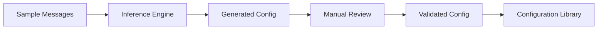

# 🔧 Segmint Configuration Management & Inference

*Last Updated: July 16, 2025*

## 📋 **Executive Summary**

Segmint's core competitive differentiation lies in **configuration as message structure inference and management**. Rather than being just another HL7 message generator, Segmint is a **configuration-aware validation and onboarding engine** that automatically analyzes real HL7 messages to understand how healthcare systems actually implement their interfaces.

This approach enables healthcare interface engineers, testers, and analysts to:
- **Rapidly onboard vendor interfaces** by inferring structure from sample messages
- **Precisely track changes** in live HL7 traffic through version-controlled configurations
- **Validate conformance** against known vendor patterns
- **Detect and explain deviations** using sophisticated diffing mechanisms
- **Support normalization pipelines** with vendor-specific transformation rules

---

## 🎯 **What is a Segmint Configuration?**

A **Segmint Configuration** is a structured, machine-readable JSON definition that describes how a particular healthcare system or vendor (e.g., Epic, Cerner, CorEMR) implements and populates HL7 messages.

### **Core Concept**
While HL7 specifications define *what fields can exist*, real-world implementations vary dramatically in:
- **Which fields are actually populated**
- **What values appear in those fields**
- **How data is structured within composite fields**
- **Vendor-specific extensions and interpretations**

Segmint configurations capture these **implementation-specific patterns** rather than just theoretical HL7 standards.

### **Example Configuration**
```json
{
  "vendor": "Epic MyChart",
  "version": "2022.3",
  "message_type": "ORM^O01",
  "inferred_from": {
    "sample_count": 1247,
    "date_range": "2024-01-15 to 2024-03-20",
    "confidence": 0.95
  },
  "segments": {
    "MSH": {
      "3": "EpicMyChart",
      "4": "EPIC",
      "5": "LabVendor", 
      "6": "LAB",
      "9.1": "ORM",
      "9.2": "O01",
      "10": "auto_generated",
      "11": "P",
      "12": "2.3"
    },
    "PID": {
      "2": "account_number",
      "3.1": "mrn",
      "3.4": "EPIC",
      "5.1": "last_name",
      "5.2": "first_name", 
      "5.3": "middle_initial",
      "7": "dob_yyyymmdd",
      "8": "gender_code",
      "11.1": "street_address",
      "11.3": "city",
      "11.4": "state",
      "11.5": "zip_code"
    },
    "ORC": {
      "1": "NW",
      "2.1": "order_number",
      "2.2": "EPIC",
      "12.1": "ordering_provider_last",
      "12.2": "ordering_provider_first",
      "12.9": "npi_number"
    },
    "OBR": {
      "1": "sequence_number",
      "2.1": "placer_order_number", 
      "4.1": "loinc_code",
      "4.2": "test_description",
      "7": "order_datetime",
      "16.1": "ordering_provider_last",
      "16.2": "ordering_provider_first"
    }
  },
  "patterns": {
    "timestamp_format": "YYYYMMDDHHMMSS",
    "identifier_format": "numeric_only",
    "name_format": "last^first^middle",
    "extensions": ["epic_custom_z_segments"]
  },
  "validation_rules": [
    {
      "field": "PID.3.1",
      "rule": "length_exactly_7_digits",
      "message": "Epic MRN must be exactly 7 digits"
    },
    {
      "field": "ORC.12.9", 
      "rule": "npi_format_validation",
      "message": "NPI must be 10 digits"
    }
  ]
}
```

---

## 🔍 **Configuration Inference Process**

### **1. Message Analysis**
Segmint analyzes collections of real HL7 messages to identify patterns:

```bash
# Analyze sample messages to infer configuration
segmint analyze --input samples/epic_lab_orders/ --output configs/epic_lab_orm.json

# Analysis includes:
# - Field population frequency
# - Value format patterns  
# - Data type detection
# - Composite field structure
# - Timestamp formats
# - Identifier patterns
```

### **2. Pattern Recognition**
The inference engine identifies:
- **Populated Fields**: Which segments and fields contain data
- **Value Patterns**: Data formats, lengths, and validation rules
- **Structural Patterns**: How composite fields are organized
- **Vendor Signatures**: Unique implementation characteristics

### **3. Configuration Generation**
Output includes:
- **Field Mappings**: Semantic meaning of populated fields
- **Validation Rules**: Vendor-specific constraints
- **Format Patterns**: How data is structured
- **Confidence Metrics**: Statistical reliability of inferences

---

## 🏥 **Vendor-Specific Configurations**

### **Epic Configurations**
```json
{
  "vendor": "Epic",
  "variants": [
    {
      "product": "MyChart",
      "version": "2022.3",
      "configuration_id": "epic_mychart_2022_3_orm"
    },
    {
      "product": "Hyperspace", 
      "version": "2023.1",
      "configuration_id": "epic_hyperspace_2023_1_adt"
    }
  ],
  "characteristics": {
    "identifier_style": "alphanumeric_with_facility_prefix",
    "timestamp_precision": "seconds",
    "custom_segments": ["ZPI", "ZPD", "ZEF"],
    "field_extensions": true
  }
}
```

### **Cerner Configurations**
```json
{
  "vendor": "Cerner",
  "variants": [
    {
      "product": "PowerChart",
      "version": "2022.04",
      "configuration_id": "cerner_powerchart_2022_04_rde"
    }
  ],
  "characteristics": {
    "identifier_style": "numeric_sequential",
    "timestamp_precision": "milliseconds", 
    "custom_segments": ["ZRX", "ZOR"],
    "field_extensions": false
  }
}
```

---

## ⚙️ **Configuration Management Workflow**

### **1. Initial Interface Onboarding**


### **2. Ongoing Interface Management**
```bash
# Compare new messages against known configuration
segmint validate --config configs/epic_lab_orm.json --input new_messages/

# Detect configuration drift
segmint diff --baseline configs/epic_lab_orm.json --current new_samples/

# Update configuration based on new patterns
segmint update-config --config configs/epic_lab_orm.json --samples recent_changes/
```

### **3. Configuration Versioning**
```json
{
  "configuration_history": [
    {
      "version": "1.0",
      "date": "2024-01-15",
      "changes": "Initial inference from Epic upgrade",
      "confidence": 0.87,
      "sample_size": 450
    },
    {
      "version": "1.1", 
      "date": "2024-03-20",
      "changes": "Added ZPI segment support, updated timestamp format",
      "confidence": 0.95,
      "sample_size": 1247
    }
  ]
}
```

---

## 🔬 **Configuration-Aware Validation**

### **Structural Validation**
```csharp
// Validate message against inferred vendor pattern
var validator = new ConfigurationValidator("configs/epic_lab_orm.json");
var result = validator.ValidateMessage(hl7Message);

if (!result.IsValid)
{
    foreach (var deviation in result.Deviations)
    {
        Console.WriteLine($"Deviation: {deviation.Field} - {deviation.Expected} vs {deviation.Actual}");
        Console.WriteLine($"Confidence: {deviation.Confidence}");
    }
}
```

### **Deviation Detection**
```json
{
  "validation_result": {
    "overall_conformance": 0.87,
    "deviations": [
      {
        "field": "PID.3.1",
        "expected_pattern": "7_digit_numeric",
        "actual_value": "MRN123456789",
        "deviation_type": "format_mismatch",
        "severity": "warning",
        "confidence": 0.92
      },
      {
        "field": "ORC.12.9",
        "expected_pattern": "present",
        "actual_value": "missing",
        "deviation_type": "missing_field",
        "severity": "error", 
        "confidence": 0.98
      }
    ]
  }
}
```

---

## 🚀 **Configuration-Driven Message Generation**

### **Smart Generation**
```csharp
// Generate messages that conform to vendor patterns
var generator = new ConfigurationDrivenGenerator("configs/epic_lab_orm.json");

var message = generator.CreateMessage(new MessageRequest
{
    PatientMRN = "1234567", // Will format according to Epic pattern
    OrderingProvider = "Smith^John^M", // Will populate ORC.12 correctly
    TestCode = "CBC", // Will map to appropriate LOINC in OBR.4
    Facility = "MAIN" // Will populate according to Epic's facility coding
});
```

### **Pattern-Aware Population**
The generator ensures:
- **Field formats** match vendor expectations
- **Required fields** are populated according to vendor patterns
- **Optional fields** follow vendor conventions
- **Custom segments** are included when expected

---

## 📊 **Configuration Analytics**

### **Interface Health Monitoring**
```json
{
  "interface_metrics": {
    "conformance_trend": [
      {"date": "2024-01-01", "conformance": 0.95},
      {"date": "2024-01-15", "conformance": 0.87},
      {"date": "2024-02-01", "conformance": 0.92}
    ],
    "common_deviations": [
      {
        "field": "PID.3.1",
        "frequency": 0.13,
        "impact": "low"
      }
    ],
    "configuration_stability": 0.94
  }
}
```

### **Vendor Comparison**
```bash
# Compare implementations across vendors
segmint compare --config1 epic_lab_orm.json --config2 cerner_lab_orm.json

# Output shows:
# - Field population differences
# - Format variations
# - Extension usage
# - Conformance patterns
```

---

## 🔧 **API Integration**

### **Configuration Service**
```csharp
public interface IConfigurationService
{
    Task<Configuration> InferFromSamples(IEnumerable<string> hl7Messages);
    Task<ValidationResult> ValidateAgainstConfig(string configId, string hl7Message);
    Task<DiffResult> CompareConfigurations(string config1Id, string config2Id);
    Task<IEnumerable<Configuration>> FindSimilarConfigurations(Configuration target);
    Task<Configuration> UpdateConfigurationFromSamples(string configId, IEnumerable<string> newSamples);
}
```

### **CLI Integration**
```bash
# Core configuration management commands
segmint config infer --samples samples/ --output epic_orm.json
segmint config validate --config epic_orm.json --message test.hl7
segmint config diff --baseline epic_orm_v1.json --current epic_orm_v2.json
segmint config list --vendor Epic --message-type ORM
segmint config export --config epic_orm.json --format openapi
```

---

## 🎯 **Use Cases & Value Proposition**

### **Interface Engineers**
- **Rapid Onboarding**: "We need to connect to a new Epic installation - what does their HL7 actually look like?"
- **Change Detection**: "Did something change in the latest vendor upgrade?"
- **Troubleshooting**: "Why are messages failing validation? What's different from the expected pattern?"

### **Quality Assurance Teams**
- **Conformance Testing**: "Are our test messages realistic for this vendor?"
- **Regression Testing**: "Does our new release still handle Epic messages correctly?"
- **Coverage Analysis**: "Are we testing all the field variations this vendor actually sends?"

### **Integration Teams**
- **Normalization**: "How do we map Epic's patient ID format to our internal format?"
- **Transformation**: "What's the most common way Cerner sends physician information?"
- **Validation**: "Is this message structured the way this vendor typically sends them?"

---

## 🛣️ **Configuration Roadmap**

### **Phase 5A: Configuration Inference Engine**
- [ ] Build message analysis pipeline
- [ ] Implement pattern recognition algorithms  
- [ ] Create statistical confidence models
- [ ] Develop configuration JSON schema

### **Phase 5B: Vendor Configuration Library**
- [ ] Build Epic configuration templates
- [ ] Create Cerner configuration patterns
- [ ] Add AllScripts/Veradigm patterns
- [ ] Include common MEDITECH implementations

### **Phase 5C: Configuration-Aware Validation**
- [ ] Implement deviation detection engine
- [ ] Build conformance scoring algorithms
- [ ] Create configuration diffing tools
- [ ] Add trend analysis capabilities

### **Phase 5D: Advanced Configuration Features**
- [ ] Machine learning pattern detection
- [ ] Automated configuration updates
- [ ] Configuration marketplace/sharing
- [ ] Real-time conformance monitoring

---

*This configuration-centric approach positions Segmint as the premier tool for understanding, managing, and working with real-world HL7 implementations rather than just theoretical standards compliance.*